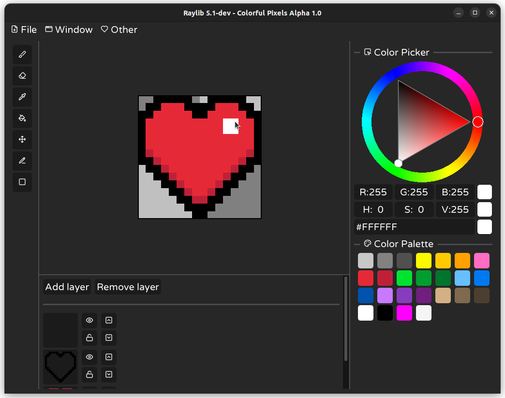

# Colorful Pixels 🎨

## Overview:
**Colorful Pixels** is a simple and easy-to-use pixel-art editor.

Software supports all range of useful features, designed to make your life easy and comfortable:
- Clean User-Interface with light and dark theme. 
- Full range of tools to draw, delete and manipulate your creations.
- Layer system with options to preview, lock, enable visibility and move every layer up and down.
- Versatile color manipulation.

## Licence
This template is under the **[MIT Licence](https://github.com/itsYakub/Colorful-Pixels/blob/main/LICENCE)**.

<!-- Badges: https://github.com/Ileriayo/markdown-badges -->